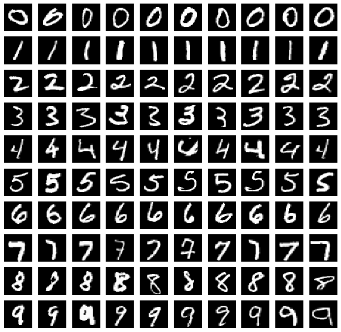
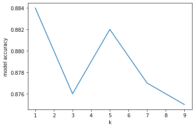
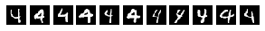
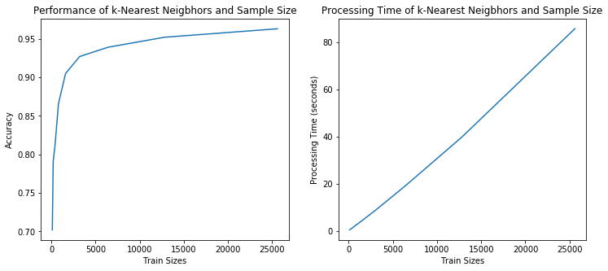

## An Introduction to Digit Image Classification with KNN and the MNIST Dataset
November 22, 2020

### Table of Contents

* Introduction
* What is the MNIST dataset?
* Classification models: KNN, Naive Bayes, and Logistic
* Code
* Challenges
* Summary

### Introduction

In this tutorial, we will introduce the MNIST dataset and show how to use K-Nearest Neighbors (KNN) and Naive Bayes to classify images as digits.

The inference problem is:

* given handwritten images of vector X
* classify the images as digits between 0-9 as y


### What is MNIST? 

MNIST is a large dataset of handwritten images often used for image processing models.  The dataset contains over 60,000 images of 28x28 pixels.  


### A Quick Review of KNN, Naive Bayes, and Logistic Regression


### Digit Classification in Code

We'll start off by loading the neccesary libraries.  

```python
import time
import numpy as np
import matplotlib.pyplot as plt
from sklearn.datasets import fetch_openml
from sklearn.neighbors import KNeighborsClassifier
from sklearn.metrics import confusion_matrix
from sklearn.metrics import classification_report

# Set the randomizer seed so results are the same each time.
np.random.seed(0)
```

Next the dataset is loaded and prepared for modeling in three ways: (1) scale down the greyscale, (2) shuffle the dataset, and (3) split into train, test, and dev.
A mini_train_data and mini_train_labels dataset is also created to reduce operating time in some of the data exploration.  In total, there are 70,000 examples or rows of data and each example contains 784 columns of pixel values that represent the image.

```python
# Load the digit data from https://www.openml.org/d/554 or from default local location '~/scikit_learn_data/...'
X, Y = fetch_openml(name='mnist_784', return_X_y=True, cache=False)

# Rescale grayscale values to [0,1].
X = X / 255.0

# Shuffle the input: create a random permutation of the integers between 0 and the number of data points and apply this
# permutation to X and Y.
# NOTE: Each time you run this cell, you'll re-shuffle the data, resulting in a different ordering.
shuffle = np.random.permutation(np.arange(X.shape[0]))
X, Y = X[shuffle], Y[shuffle]

print('data shape: ', X.shape)
print('label shape:', Y.shape)

# Set some variables to hold test, dev, and training data.
test_data, test_labels = X[61000:], Y[61000:]
dev_data, dev_labels = X[60000:61000], Y[60000:61000]
train_data, train_labels = X[:60000], Y[:60000]
mini_train_data, mini_train_labels = X[:1000], Y[:1000]
```

```python
data shape:  (70000, 784)
label shape: (70000,)
```

To get a sense of the dataset, the handwritten digit images are visualized with the imshow() function.  Ten images are randomly choosen from each digit in the mini_train_data set.  Recall that each sample contains 784 columns of pixel values or features and if reshaped to 28x28 grid, would form an image.

```python
examples = 10
digits = 10
fig, axs = plt.subplots(nrows=digits, ncols=examples, figsize=(10, 10))
plt.rc('image', cmap='gray')

# Plots the first 10 digits from the mini_train_data set
for i in range(examples):
    for j in range(digits) :
        num_match = mini_train_data[mini_train_labels == str(j)]  # Select data for each digit
        num = num_match[np.random.randint(len(num_match))]        # Randomly select examples from the data
        num_image = np.reshape(num, (28,28))                      # Reshape 784 colums to 28x28
        
        # Plots the images of each example for each digit
        axs[j][i].imshow(num_image)
        axs[j][i].axis("off")
```



It is apparent how diverse handwritten numbers can be.  Sometimes zeros look like sixes, and sometimes fives look like an $s$.  In the next few steps, models will be developed and we can see how they handle the handwritten numbers.

First we will model the MNIST dataset with KNN.  The model will be evaluated based on the accuracy of the predictions against mini_train_labels.  In addition, we will look at how the number of k values, the training size, and Gaussian blur can affect the model performance.

The following script builds the KNN model, increments through a few different values of k, and plots the accuracy.  The KNN model is built using the KNeighborsClassifier() function from the sklearn library and by default, uses the Minkowski distance metric.  Recall the MNIST dataset contains 784 pixel values.  At inference time, each test example containing 784 pixel values are compared to labeld training examples and test examples are classified based on their shortest Minkowski distance to the labedl training example.  It is apparent from the accuracy vs k neighbors plot that increasing the number k neighbors resulted in a loss of accuracy and overfitting.  In the following examples, we will continue with k=1.

```python
# Build KNN model
target_names = np.unique(mini_train_labels)
k_values = [1, 3, 5, 7, 9]
model_accuracy = []
for k in k_values:
    target_names = np.unique(mini_train_labels)
    model = KNeighborsClassifier(n_neighbors = k)
    model.fit(mini_train_data, mini_train_labels)
    predicted_labels = model.predict(dev_data)
    model_accuracy = classification_report(y_true=dev_labels, y_pred=predicted_labels,  # Get the accuracy for each k
                          target_names=target_names, output_dict=True)['accuracy']

# Plot results
plt.plot(k_values, model_accuracy)
plt.xlabel('k')
plt.ylabel('model accuracy')
```


With an accuracy of 88%, its not bad!  Let's take a look at which digits KNN how difficulties with.

The following script grabs the confusion matrix for a KNN model where k=1.  The x and y axis of the confusion matrix represents predicted digits vs labeld digits from the dev set.  The diagonal of the confusion matrix represent the number of times the model was correct and the off diagonals represents where the model predicted incorrectly.  The most incorrect predictions come from when a dev example was a *4* but was labeled as a *9*.

``python
# 1-Nearest Neighbor model and produce confusion matrix                 
model = KNeighborsClassifier(n_neighbors = 1)               
model.fit(mini_train_data, mini_train_labels)               
predicted_labels = model.predict(dev_data)                  

print("Confusion Matrix")
print(confusion_matrix(dev_labels, predicted_labels))       
```
```python
Confusion Matrix
[[101   0   1   0   0   0   1   1   2   0]
 [  0 116   1   0   0   0   0   0   1   0]
 [  1   4  84   2   2   0   2   4   6   1]
 [  0   2   0  84   0   6   0   2   3   0]
 [  0   0   1   0  78   0   0   2   0  11]
 [  2   0   0   1   1  77   5   0   2   0]
 [  1   2   1   0   1   2  94   0   1   0]
 [  0   1   1   0   0   0   0  96   0   4]
 [  1   5   4   3   1   3   0   1  72   4]
 [  0   1   0   0   3   2   0   7   0  82]]
```

To dig a bit deeper, the following script grabs the dev examples which were labled 4 and predicted as 9 by the model.

```python
# Creates a list of pairs (dev_labels, predicted_labels)
pair_true_predicted = []                                
for x, y in zip(dev_labels, predicted_labels):
    pair_true_predicted.append((x, y))                          

# Record which index positions correspond to incorrect predictions
incorrect_prediction = []                               
for i in range(len(pair_true_predicted)):
    if pair_true_predicted[i] == ('4', '9'):          # Check where the model was provided '4' but predicted '9'
        incorrect_prediction.append(i)

# Initialize a plot
fig, axs = plt.subplots(nrows=1, ncols=len(incorrect_prediction), figsize=(5, 10))
print('\nExamples of 4 were predicted as 9')

# Produce a subplot of the 4s that were incorrectly predicted
i = 0
for j in incorrect_prediction:
    num_image = np.reshape(dev_data[j], (28,28))      
        
    axs[i].imshow(num_image)                        
    axs[i].axis("off")
    i = i + 1
```


Manipulating the hyperparameter k is one way to improve the accuracy of KNN and another way is increasing the amount of training data.  More training data gives the model more comparisons with the distance metric and should provide more accurate predictions.  A drawback however, is that there are more computations to perform.  Thus, KNN is model that requires no fitting time but a significantly computational inference time.

The following script explores accuracy vs training sizes from 100 to 25,600 rows of data.  It also record the amount of time it takes perform inference on the dev set.  From the plots, the accuracy begins to plateu at 10,000 examples while the inference time contains to increase linearly - a clear situation of diminishing returns.  

```python
# Initialize subplots and the list of train sizes
fig, (ax1, ax2) = plt.subplots(nrows=1, ncols=2, figsize=(12,5))
train_sizes = [100, 200, 400, 800, 1600, 3200, 6400, 12800, 25600]

# Build a funcion that performs 1-Nearest Neighbor for each train size
def kNN_accuracies(train_data, train_labels, dev_data, dev_labels, train_sizes):
    times = []
    accuracies = []
    
    for sizes in train_sizes:
        t1_start = time.process_time()                            # Start recording process time             
        shuffle = np.random.permutation(np.arange(sizes))         # Shuffle for random sampling

        # 1-Nearest Neighbor
        target_names = np.unique(train_labels)                    
        model = KNeighborsClassifier(n_neighbors = 1)             
        model.fit(train_data[shuffle], train_labels[shuffle])     
        predicted_labels = model.predict(dev_data)                
        
        # Get accuracies for each train size
        accuracies.append(classification_report(y_true=dev_labels, y_pred=predicted_labels, 
                                                target_names=target_names, output_dict=True)['accuracy'])
    
        t1_stop = time.process_time()                              # End recording process time
        times.append(t1_stop-t1_start)                             # Calculate elapse process time
        
    return(times, accuracies)

# Store the accuracies and process times for each train size
times, accuracies = kNN_accuracies(train_data, train_labels, dev_data, dev_labels, train_sizes)
        
# Plots Accuracies vs Train Sizes
ax1.plot(train_sizes, accuracies)
ax1.set_xlabel('Train Sizes')
ax1.set_ylabel('Accuracy')
ax1.set_title('Performance of k-Nearest Neigbhors and Sample Size')

# Plots Processing Time vs Train Sizes
ax2.plot(train_sizes, times)
ax2.set_xlabel('Train Sizes')
ax2.set_ylabel('Processing Time (seconds)')
ax2.set_title('Processing Time of k-Nearest Neigbhors and Sample Size')
plt.show
```



### References
https://sli0111.github.io/k-nearest-neighbors/


